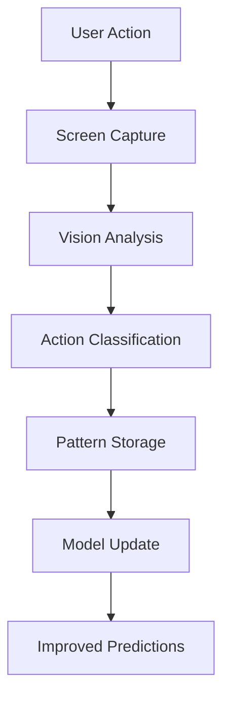

# Runix AI System Guide

## Overview

The Runix AI System transforms automation from traditional scripting to intelligent, autonomous task completion. It combines computer vision, natural language processing, and machine learning to create a truly intelligent automation platform.

## Key Concepts

### Autonomous Agents
AI agents that can understand tasks described in natural language and execute them using available drivers. Agents can:
- Plan multi-step workflows
- Adapt to changing UI conditions
- Handle errors and unexpected states
- Learn from user corrections

### Action Learning
The system observes user interactions and converts them into reproducible automation scripts. This enables:
- Zero-code automation creation
- Pattern recognition across applications
- Workflow optimization suggestions
- Team knowledge sharing

### Intelligent Assistance
Contextual help that understands the current state and can perform actions on behalf of the user:
- Screen reading and explanation
- Element identification and interaction
- Information retrieval and analysis
- Guided task completion

## Architecture Deep Dive

### AI Decision Engine

```typescript
interface AIDecisionEngine {
  // Analyze current state and determine next action
  planNextAction(context: SceneContext): Promise<PlannedAction>;
  
  // Evaluate action success and adapt strategy
  evaluateResult(action: ExecutedAction, result: ActionResult): Promise<void>;
  
  // Handle stuck situations by requesting help or trying alternatives
  handleStuckState(context: StuckContext): Promise<RecoveryStrategy>;
}
```

### Vision Integration

The AI system leverages the Vision Driver for:
- **Screen Understanding**: OCR and UI element detection
- **Change Detection**: Identifying when actions have completed
- **Validation**: Confirming actions had intended effects
- **Context Awareness**: Understanding current application state

### Learning Pipeline



## Advanced Usage

### Custom AI Prompts

Create domain-specific prompts for better AI performance:

```javascript
// prompts/ecommerce.js
export const ecommercePrompts = {
  checkout: `
    You are helping complete an e-commerce checkout. Consider:
    - Verify cart contents before payment
    - Check shipping address accuracy
    - Confirm payment method security
    - Look for discount codes or offers
    - Validate order total calculations
  `,
  
  productSearch: `
    Help the user find products efficiently:
    - Use filters to narrow results
    - Sort by relevant criteria (price, ratings, etc.)
    - Compare similar products
    - Check availability and shipping options
  `
};
```

### AI-Human Collaboration

Configure different collaboration modes:

```typescript
const collaborationConfig = {
  mode: 'collaborative', // 'autonomous', 'supervised', 'collaborative'
  
  humanInvolvementTriggers: {
    uncertaintyThreshold: 0.7,     // Ask for help when confidence < 70%
    criticalActions: ['delete', 'submit', 'purchase'],
    newApplications: true,         // Always ask in unfamiliar apps
    errorRecovery: 'always'        // Human help after 2 failures
  },
  
  learningFromHumans: {
    captureCorrections: true,      // Learn when human overrides AI
    explainReasons: true,          // Ask human to explain corrections
    validateLearning: true         // Confirm understanding before applying
  }
};
```

### Multi-Agent Workflows

Coordinate multiple AI agents for complex tasks:

```gherkin
Feature: Multi-agent data migration
  As a system administrator
  I want to migrate data between systems
  So that information is properly transferred

  Background:
    Given agent "extractor" is configured for source system
    And agent "validator" is configured for data validation
    And agent "loader" is configured for target system

  Scenario: Coordinated data migration
    Given extractor agent extracts data from source
    When validator agent validates extracted data
    And loader agent imports validated data to target
    Then migration summary is generated
    And all agents report completion status
```

### Performance Optimization

#### Caching Strategies

```typescript
interface AICache {
  // Cache vision analysis results
  screenAnalysis: Map<string, AnalysisResult>;
  
  // Cache successful action patterns
  actionPatterns: Map<string, ActionSequence>;
  
  // Cache element selectors for applications
  elementMappings: Map<string, SelectorMap>;
}
```

#### Parallel Processing

```typescript
// Process multiple screens simultaneously
const results = await Promise.all([
  aiDriver.execute('analyze', [screenshot1]),
  aiDriver.execute('analyze', [screenshot2]),
  aiDriver.execute('analyze', [screenshot3])
]);
```

## Integration Patterns

### CI/CD Integration

Integrate AI-generated tests into your pipeline:

```yaml
# .github/workflows/ai-tests.yml
name: AI-Generated Tests
on: [push, pull_request]

jobs:
  ai-validation:
    runs-on: ubuntu-latest
    steps:
      - uses: actions/checkout@v3
      - name: Setup Runix
        run: npm install -g runix
      - name: Generate AI tests
        run: |
          runix ai agent "Test critical user journeys" --output=ci-tests/
      - name: Execute generated tests
        run: |
          runix run ci-tests/*.feature --format=junit
```

### Development Workflow

Integrate AI assistance into development:

```bash
# Generate tests for new features
runix ai agent "Test the new user registration flow"

# Learn from manual testing
runix ai editor "regression-test-$(date +%Y%m%d)"

# Get help with debugging
runix ai ask "Why is this form validation failing?"
```

### Monitoring and Analytics

Track AI automation performance:

```typescript
interface AIMetrics {
  taskCompletionRate: number;
  averageExecutionTime: number;
  humanInterventionRate: number;
  learningAccuracy: number;
  errorRecoverySuccess: number;
}
```

## Best Practices

### Prompt Engineering

1. **Be Specific**: Provide clear, detailed task descriptions
2. **Include Context**: Mention current state and constraints
3. **Set Expectations**: Define success criteria
4. **Handle Edge Cases**: Describe what to do if something goes wrong

```typescript
// Good prompt
const goodPrompt = `
Complete the user registration process:
1. Fill out the form with test data (use email: test@example.com)
2. Accept terms and conditions
3. Submit the form
4. Wait for confirmation message
5. If captcha appears, request human help
Success criteria: Registration confirmation page is displayed
`;

// Poor prompt  
const poorPrompt = "Register a user";
```

### Error Handling

Implement robust error recovery:

```typescript
const errorHandling = {
  retry: {
    maxAttempts: 3,
    backoffStrategy: 'exponential',
    retryableErrors: ['element_not_found', 'timeout', 'network_error']
  },
  
  fallback: {
    useAlternativeSelectors: true,
    requestHumanHelp: true,
    saveDebugInfo: true
  },
  
  learning: {
    updatePatternsOnFailure: true,
    saveCorrectionsFromHuman: true,
    improveSelectorReliability: true
  }
};
```

### Security Guidelines

1. **Sandbox AI Operations**: Limit file system and network access
2. **Validate Inputs**: Sanitize all user inputs and AI outputs
3. **Audit Actions**: Log all AI decisions and actions
4. **Human Oversight**: Require approval for sensitive operations

```typescript
const securityConfig = {
  sandboxMode: true,
  allowedDomains: ['*.example.com', 'localhost'],
  forbiddenActions: ['delete_file', 'system_shutdown'],
  requireApproval: ['financial_transactions', 'data_deletion'],
  auditLevel: 'detailed'
};
```

## Troubleshooting

### Common Issues

#### AI Makes Wrong Decisions

**Symptoms**: AI clicks wrong elements or misunderstands tasks
**Solutions**:
1. Improve prompt specificity
2. Add more context about current state
3. Use editor mode to show correct behavior
4. Check vision driver accuracy

```bash
# Debug AI decision making
runix ai agent "task" --debug --save-reasoning

# Check vision accuracy
runix test vision --screenshot=current.png

# Retrain with correct examples
runix ai learn --from=correct-examples/
```

#### Performance Issues

**Symptoms**: AI takes too long to complete tasks
**Solutions**:
1. Enable caching for repeated operations
2. Use parallel processing where possible
3. Optimize vision analysis settings
4. Reduce screenshot frequency

```bash
# Enable performance optimizations
export RUNIX_AI_CACHE_ENABLED=true
export RUNIX_AI_PARALLEL_ANALYSIS=true
export RUNIX_AI_SCREENSHOT_INTERVAL=5000
```

#### Integration Problems

**Symptoms**: AI doesn't work well with specific applications
**Solutions**:
1. Create application-specific prompts
2. Train on application workflows
3. Adjust vision detection thresholds
4. Use custom selectors

### Debug Tools

#### AI Decision Visualization

```bash
# View AI reasoning process
runix ai explain --task-id=task-123

# Visualize decision tree
runix ai visualize --decision-path=artifacts/decisions.json

# Compare successful vs failed attempts
runix ai compare --success=task-456 --failure=task-789
```

#### Performance Profiling

```bash
# Profile AI task execution
runix ai profile --task="complex workflow"

# Analyze bottlenecks
runix ai analyze --performance --time-range="last-week"

# Generate optimization suggestions
runix ai optimize --based-on=performance-profile.json
```

## Contributing to AI Features

### Development Setup

```bash
# Clone and setup
git clone https://github.com/runix/runix.git
cd runix

# Install AI dependencies
npm install --include=optional

# Setup development environment
cp .env.example .env.development
# Add your OpenAI API key to .env.development

# Run AI tests
npm run test:ai
```

### Adding New AI Capabilities

1. **Extend the AIDriver class**
2. **Add corresponding prompt templates**
3. **Implement tests for new functionality**
4. **Update documentation and examples**

### Testing AI Features

```bash
# Unit tests for AI logic
npm run test:ai:unit

# Integration tests with real drivers
npm run test:ai:integration

# End-to-end tests with real applications
npm run test:ai:e2e

# Performance and load tests
npm run test:ai:performance
```

## Future Roadmap

### Short Term (Q1 2024)
- Voice command integration
- Mobile application support
- Advanced learning algorithms
- Real-time collaboration features

### Medium Term (Q2-Q3 2024)
- Multi-language support
- Custom model training
- Advanced debugging tools
- Enterprise security features

### Long Term (Q4 2024+)
- Cross-platform automation
- AI-powered test generation
- Predictive failure analysis
- Autonomous system maintenance

---

The Runix AI System represents the future of automation - intelligent, adaptive, and collaborative. By combining the power of artificial intelligence with robust automation drivers, it enables unprecedented levels of productivity and efficiency.

For more information, see the [AI README](../src/ai/README.md) or join our [community discussions](https://github.com/runix/runix/discussions).
